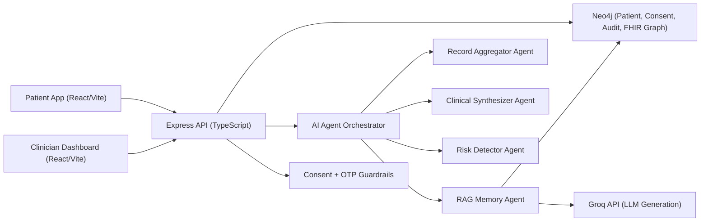

# MedMemory OS

## What is this
MedMemory OS is a hackathon-built health data platform that consolidates fragmented patient records into a single timeline and enables consent-based access for clinicians. It combines AI-assisted clinical summarization, risk signals, and RAG-style question answering over patient history.

## Why we built this
Healthcare records are often scattered across hospitals, labs, and systems, making continuity of care difficult. We built MedMemory OS to provide a secure, consent-first way to unify records, improve clinical decision speed, and give patients control over who can access their data.

## Repository structure
```text
Med-Memory/
├─ code/
│  ├─ client/                 # React + Vite + TypeScript frontend
│  │  ├─ src/
│  │  │  ├─ pages/            # Patient/Clinician dashboards and flows
│  │  │  ├─ components/       # Reusable UI/layout components
│  │  │  ├─ hooks/            # Frontend data/session hooks
│  │  │  ├─ services/         # API client layer
│  │  │  └─ types/            # Shared frontend types
│  │  └─ package.json
│  └─ server/                 # Node.js + Express + TypeScript backend
│     ├─ src/
│     │  ├─ routes/           # Auth, patients, consent, audit, FHIR routes
│     │  ├─ agents/           # Aggregation, synthesis, risk, RAG logic
│     │  ├─ db/               # Neo4j connection and seed scripts
│     │  ├─ middleware/       # Auth and consent guards
│     │  └─ fhir/             # FHIR mock endpoints and normalization
│     └─ package.json
├─ docker-compose.yml         # Local multi-service orchestration
├─ start.bat                  # Windows convenience startup script
├─ requirements.txt           # Python deps used in hack workflows/utilities
└─ README.md
```

## Key links
- Frontend (local): `http://localhost:5173`
- Backend API (local): `http://localhost:4000`
- Neo4j Browser (local): `http://localhost:7474`
- API health check (local): `http://localhost:4000/health`

## Architecture diagram (Mermaid)


## Dockerization
This project is container-friendly via `docker-compose.yml` and is designed to run frontend, backend, and Neo4j together.

Typical services:
- `frontend`: React/Vite app
- `server`: Express API
- `neo4j`: Graph database

Bring up all services:
```bash
docker compose up --build
```

Run in detached mode:
```bash
docker compose up -d --build
```

## Build & run instructions
1. Install dependencies for both apps.
2. Configure environment variables.
3. Start Neo4j.
4. Start backend server.
5. Start frontend.
6. Open the frontend URL and verify API connectivity.

## Prerequisites
- Node.js 18+ and npm
- Docker Desktop (recommended for one-command startup)
- Neo4j 5+ (if not using Docker)
- Groq API key (`GROQ_API_KEY`) for AI generation
- (Optional) Hugging Face API key (`HF_API_KEY`) for hosted embeddings fallback

## Quick start
### Option A: Docker (recommended)
```bash
docker compose up --build
```

### Option B: Local services
In one terminal (backend):
```bash
cd code/server
npm install
npm run build
npm run dev
```

In another terminal (frontend):
```bash
cd code/client
npm install
npm run dev
```

If using a local Neo4j instance, ensure it is running and environment variables point to it.

## Development
Backend:
```bash
cd code/server
npm run dev
```

Frontend:
```bash
cd code/client
npm run dev
```

Useful notes:
- Frontend uses Vite and runs on port `5173` by default.
- Backend uses Express + TypeScript and typically runs on port `4000`.
- Consent/OTP and patient query flows are available in the UI for end-to-end testing.

## Testing
Current hackathon build focuses on integration-first validation.

Recommended checks:
- API health endpoint responds successfully.
- Patient login and provider consent flow works.
- AI pipeline run returns synthesis + risk output.
- RAG query returns grounded answers from available records.

Type checks:
```bash
cd code/client && npx tsc -b
cd code/server && npm run build
```

## Security
- Consent-gated access for sensitive patient data
- OTP-based authorization flow for provider access
- Role-aware route protection on backend
- Environment-based secret management (`GROQ_API_KEY`, DB credentials)
- Audit trail endpoints for traceability

## Contributing
1. Create a feature branch.
2. Keep changes scoped and documented.
3. Run type/build checks before PR.
4. Open a PR with screenshots (UI changes) and test notes.

## Maintainers
- Team: **MedMemory Builders**
- Primary maintainer: **MedMemory OS Team**
- Contact: **medmemory.team@proton.me**

## License
MIT License

## Acknowledgements
- [Groq](https://groq.com/) for fast LLM inference
- [Neo4j](https://neo4j.com/) for graph + vector-capable data storage
- [React](https://react.dev/) and [Vite](https://vitejs.dev/) for frontend development
- [Express](https://expressjs.com/) and [TypeScript](https://www.typescriptlang.org/) for backend services
- Hackathon mentors and organizers for product and architecture guidance

## Badges


